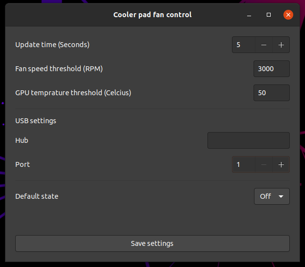

# fancontrol@coolerpad.org

1. [Definition](#1-definition)
2. [Dependencies](#2-dependencies)
3. [Environment](#3-environment)
4. [Manual](#4-manual)
    1. [Uhubctl](#41-uhubctl)
    2. [How to set it up](#42-how-to-set-it-up)
    3. [First settings](#43-first-settings)
    4. [Different modes](#44-different-modes)
5. [Upcoming features](#5-upcoming-features)

---

## 1. Definition
fancontrol@coolerpad.org is a gnome extension that automates cooling of your laptop through a cooling pad so you can concentrate on your work. It works by turning a designated USB port on/off depending on fan speed/temperature reaching the threshold.

## 2. Dependencies
Please make sure to install the following linux package:
* [Uhubctl](https://github.com/mvp/uhubctl)
>NOTE: Instructions found in the link above. Ensure you can turn your targeted USB port on/off using the package above.

## 3. Environment
* Ubuntu Canonical ```20.04```.
* Gnome ```3.36.9 ``` as tested.
> Run the command below to find your Gnome version
```
> gnome-shell --version
```
* Uhubctl - ```2.4.0-30-g6f1c71d5``` as tested.

## 4. Manual
### 4.1 Uhubctl
Refer to [section 2](#1-definition) above to make sure Uhubctl is working properly as the extension depends on this.

### 4.2 How to set it up
- Clone this repo into your local folder.
- Copy the ```fancontrol@coolerpad.org``` folder into ```~/.local/share/gnome-shell/extensions``` folder.
- Press ```Alt + F2``` to refresh all extensions.
- Fan will appear on the extension bar with the icon: 
> NOTE: On/Off/Auto options will be greyed out until you set the settings as in the next section below.

### 4.3 First settings
- Open extension menu, click "Preferences" [option](#1-preferences-option).
- Settings window will appear as in the [picture](#2-preferences-window) referenced.
- Take note of the "Hub" and "Port" inputs in the picture above, set these from your [Uhubctl instructions](#2-dependencies).
- Customize your update time, fan speed and GPU temperature threshold settings.
- Click on "Save settings" button at the bottom.
- Navigate back to extension menu and set your preferred mode.

### 4.4 Different modes
- [__On__](#3-modes) - turns on USB port power to target port.
- [__Off__](#3-modes) - turn off USB port power.
- [__Auto__](#3-modes) - monitors GPU temperature and Fan speed threshold to switch USB port power.

## 5. Upcoming features
### 5.1 Temp range mode
Sets a lower and upper boundary of temperature where if it reaches the higher boundary, the USB port power is switched on. When cooled till it has reached the lower boundary, it's switched off. 

## Picture references
### 1. Preferences option
 

### 2. Preferences window
 

### 3. Modes
  